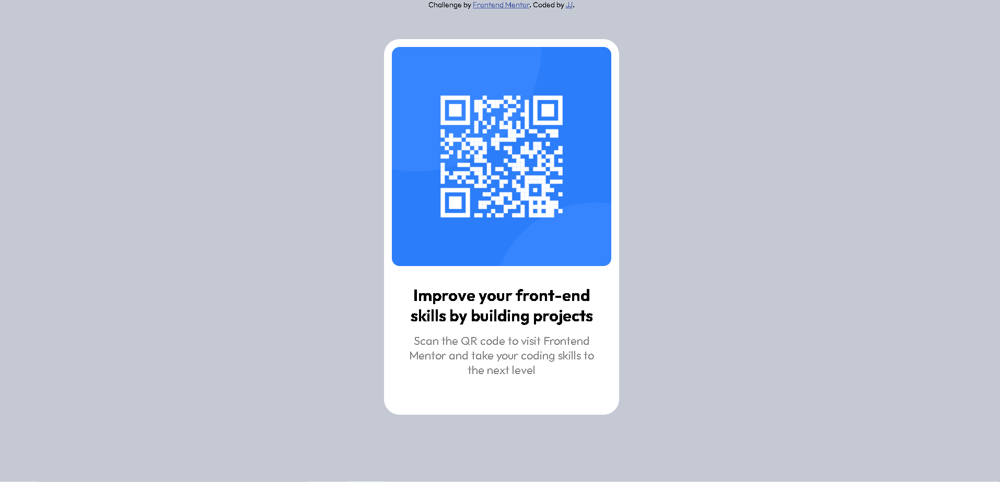

# Frontend Mentor - Interactive rating component solution

This is a solution to the [Interactive rating component challenge on Frontend Mentor](https://www.frontendmentor.io/challenges/interactive-rating-component-koxpeBUmI). Frontend Mentor challenges help you improve your coding skills by building realistic projects. 

## Table of contents

- [Overview](#overview)
  - [Screenshot](#screenshot)
  - [Links](#links)
- [My process](#my-process)
  - [Built with](#built-with)
- [Author](#author)

## Overview

### Screenshot

### Links

- Solution URL: https://github.com/JeremyPaymal/QR-code-
- Live Site URL: https://qr-code-challeng.netlify.app/

## My process

### Built with

- Semantic HTML5 markup
- CSS custom properties

## Author

- Website - [JP Project](https://jp-project.com/)
- Frontend Mentor - [@JeremyPaymal](https://www.frontendmentor.io/profile/JeremyPaymal)
- Twitter - [@JeremyPaymal](https://twitter.com/JeremyPaymal)
